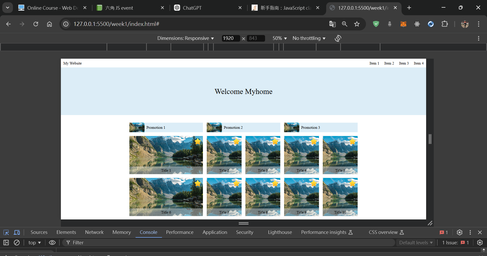
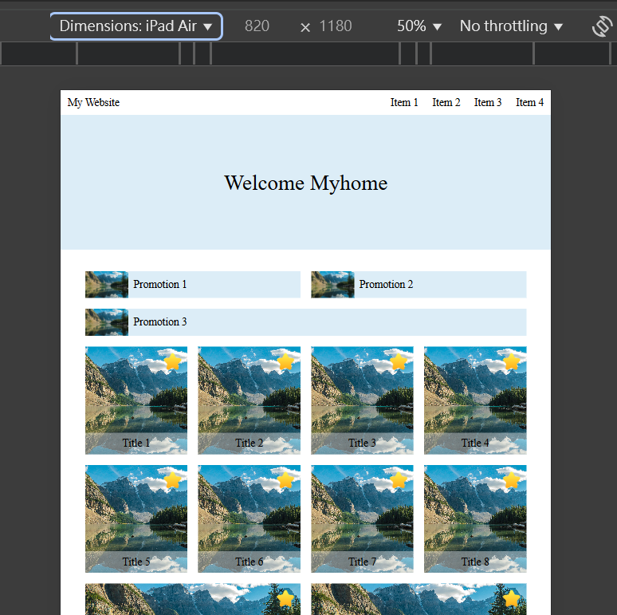
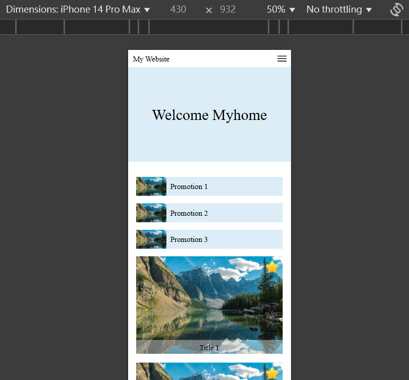
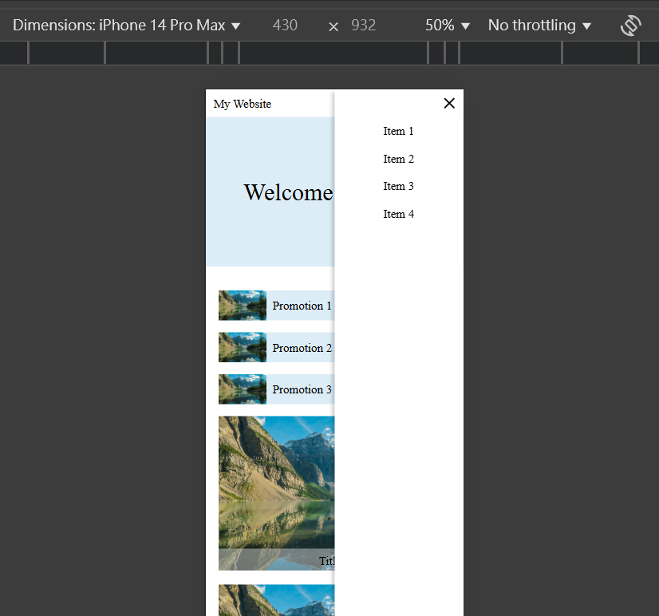

## Overview👀

Hello visitors, I created this github repo to help me practice and showcase my not so refined html and css skill.
Hope that you get a grasp of my current front end skills and help me improve what I lack by sending feedbacks.🙏🙏🙏

## Screenshot🐻💥
### week1:
#### desktop & ipad

  
  

 

#### mobile

  
  

## The challenge🔥

### 每週安排大綱
1. HTML、CSS、RWD 切版實務。
2. JavaScript、Python 基本練習。
3. JavaScript、Python 網路連線與資料運用。
4. 架設 FastAPI 網站後端伺服器。
    #### 路由詳解
    | **路由**        | **方法** | **功能描述**                            | **需要的參數**           |
    |-----------------|--------|------------------------------------------|-------------------------|
    | `/`             | GET    | 顯示首頁，包含登入表單和計算平方數輸入框    |           |
    | `/signin`       | POST   | 處理用戶登入，根據結果重定向至會員頁或錯誤頁 | `username`, `password`, `agreement` |
    | `/member`       | GET    | 顯示會員頁，只有登錄用戶能訪問              |           |
    | `/error`        | GET    | 顯示錯誤訊息頁面                          | `message`  |
    | `/signout`      | GET    | 清除 session 並登出                       |           |
    | `/square/{num}` | GET    | 顯示傳入數字的平方數                       | `num`     |

5. 架設 MySQL 資料庫伺服器。
6. 基礎會員系統開發。
7. 前端 Fetch 後端 API 整合功能開發。
8. 主題學習，實體活動，轉職經驗分享。

## What I learned💪

- 相關技術：HTML、CSS、JavaScript、Python、FastAPI、MySQL。
- 背景知識：RWD 版面設計、HTTP 通訊協定、網站三層式架構。
- 預期目標：學會網站全端開發的所有基礎技能，完成一個小型專案。
  - 前端的部份練習 RWD 網頁切版，透過 JavaScript 串接後端。
  - 後端的部份利用 Python FastAPI 架設伺服器，並串接 MySQL 資料庫。

## Author🐶

- Instagram - [@yu_dododo](https://www.instagram.com/yu_dododo/)
